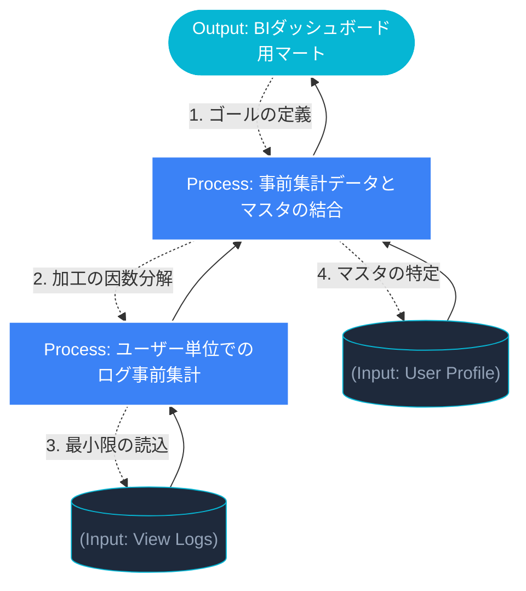

# 1.1: アウトプット逆算型（風音屋）アーキテクチャ

---

### 1. 【エンジニアの定義】Professional Definition

> **アウトプット逆算思考（Output-Driven Design）**:
> クエリ設計において「手元にあるデータ（Input）」から書き始めるのではなく、最終的に必要な「BIツールの表示結果（Output）」を定義し、そこに至るための「加工プロセス（Process）」を逆順に設計する手法。
>
> **CTE (Common Table Expression)**:
> `WITH` 句を使用して定義される一時的な結果セット。クエリを論理的なモジュールに分割することで、可読性、デバッグ性、そしてオプティマイザによる最適化効率を向上させる「クエリの構造化」の要。

---

### 2. 【0ベース・深掘り解説】Gap Filling

#### ❌ インプット駆動の罠（スパゲティSQL）
初心者や「とりあえず動けばいい」エンジニアは、以下の順序でSQLを書きます。
1. `FROM raw_logs` (とりあえず生データを読む)
2. `LEFT JOIN master_table` (とりあえずマスタを括り付ける)
3. `WHERE ... GROUP BY ...` (最後に無理やり集計する)

**結果:** JOINしてから集計するため、膨大な中間データが発生し、Sparkクラスターが悲鳴を上げます（Shuffle爆発）。また、1つのクエリが数百行になり、誰もメンテナンスできなくなります。

#### ✅ アウトプット逆算の革命
プロのエンジニアは「ゴール」から設計します。
1. **Output**: 「10代女性の月間ユニーク視聴者数」という表が欲しい。
2. **Process**: 「視聴ログをユーザーID×月で事前集計」＋「マスタからデモグラ情報を取得」。
3. **Input**: `view_logs` と `user_profiles` が必要。

この思考プロセスをコードに落とし込むのが **CTEモジュール設計** です。

---

### 3. 【視覚的ガイド】Visual Guide



---

### 4. 【技術実装】Implementation Best Practices

```sql
/* 
   名前: 01_monthly_user_metrics
   目的: 広告配信最適化のための月次ユーザー行動集計
*/

WITH 
-- ==========================================
-- 1. Input: 対象マスタの抽出（最小限の列に絞る）
-- ==========================================
target_users AS (
    SELECT 
        user_id,
        gender,
        age_group
    FROM user_profiles 
    WHERE status = 'active'
),

-- ==========================================
-- 2. Process: 事前集計（Pre-aggregation）
-- ※ JOINの【前】に集計することで、Shuffleデータ量を劇的に削減する
-- ==========================================
aggregated_views AS (
    SELECT 
        user_id,
        date_trunc('month', event_timestamp) AS target_month,
        COUNT(DISTINCT video_id)             AS unique_videos,
        SUM(view_time_sec)                   AS total_view_time
    FROM raw_view_logs
    WHERE event_timestamp >= '2024-01-01'
    GROUP BY 1, 2
)

-- ==========================================
-- 3. Output: 最終成形（Final Assembly）
-- ==========================================
SELECT 
    u.gender,
    u.age_group,
    v.target_month,
    v.unique_videos,
    v.total_view_time
FROM target_users u
-- 集計済みの「軽い」データ同士を結合するため、メモリ負荷が極めて低い
INNER JOIN aggregated_views v 
    ON u.user_id = v.user_id;
```

---

### 5. 【Key Takeaways】

- **SELECTから書かない**: まずWITH句でインプットと中間プロセスを定義する。
- **Pre-aggregation**: JOINの前にGROUP BYを済ませるのがプロの鉄則。
- **SQLは「文章」である**: 上から下に読めば、設計思想が伝わるようにCTEを配置する。
- **Catalystを信じる**: CTEによる分割はDatabricksのオプティマイザによって最適化されるため、可読性を優先して良い。
