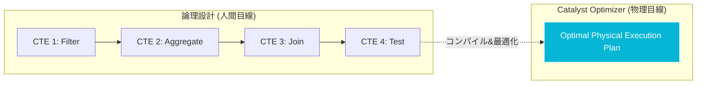

# 1.2: 論理設計 vs 物理実装（検証機能付きSQL）

---

### 1. 【エンジニアの定義】Professional Definition

> **論理設計 (Logical Design)**:
> データの意味、関係性、ビジネスルールをSQL（CTE）の構造として表現すること。人間が読んで「何を計算しているか」を理解するための設計。
>
> **物理実装 (Physical Implementation)**:
> Databricks（Spark Catalyst）がクエリを実行可能なプランに変換し、メモリアロケーションやシャッフルを制御すること。
>
> **ユニットテスト付きクエリ (Self-Testing Query)**:
> クエリ本体のロジックとは別に、データの整合性（NULLチェック、一意性チェック等）を確認するためのCTEを隠し持った設計手法。

---

### 2. 【0ベース・深掘り解説】Gap Filling

#### 🧐 「長いSQLはパフォーマンスが落ちる」という迷信
多くのエンジニアが「サブクエリやCTEを増やすと、その分一時テーブルが作られて遅くなる」と誤解しています。

**事実は逆です。** 
Databricksの **Catalyst Optimizer** は、人間が書いた「入れ子」や「分割」を全て解体し、最も効率的な実行計画（Physical Plan）に再構成します。
そのため、人間は「パフォーマンスを気にしてネストを深くする」必要は一切なく、**「最も読みやすくデバッグしやすい粒度」**でCTEを分割すべきです。

---

### 3. 【視覚的ガイド】Visual Guide



---

### 4. 【技術実装】Implementation Best Practices

#### ✅ 自己テスト機能付きクエリの実装

バグ調査のたびに `SELECT * FROM ... LIMIT 100` を挟み込むのは非効率です。設計の時点で「検証ポイント」をCTEとして用意しておきます。

```sql
WITH 
  base_sales AS (
    SELECT * FROM silver.sales WHERE amount > 0
  ),
  
  -- ★ 検証用ブロック (Production時には最終SELECTから外す)
  test__check_duplicates AS (
    SELECT transaction_id, COUNT(*) 
    FROM base_sales 
    GROUP BY 1 HAVING COUNT(*) > 1
  ),
  
  test__check_null_users AS (
    SELECT COUNT(*) AS null_count 
    FROM base_sales 
    WHERE user_id IS NULL
  ),

  final_agg AS (
    SELECT user_id, SUM(amount) AS total_amt
    FROM base_sales
    GROUP BY 1
  )

-- 通常時
SELECT * FROM final_agg;

-- デバッグ時: 1行書き換えるだけで検証結果を確認できる
-- SELECT * FROM test__check_null_users;
```

---

### 5. 【Key Takeaways】

- **論理と物理を分ける**: パフォーマンスチューニングのためにコードの読みやすさを犠牲にしない。
- **デバッグを「資産」にする**: 調査に使ったクエリを捨てずに `test__` CTEとして残しておくことで、ドキュメントの代わりになる。
- **Catalystを味方につける**: `EXPLAIN` コマンドを使用して、自分の書いた論理構造がどのように物理最適化されたかを確認する習慣をつける。
