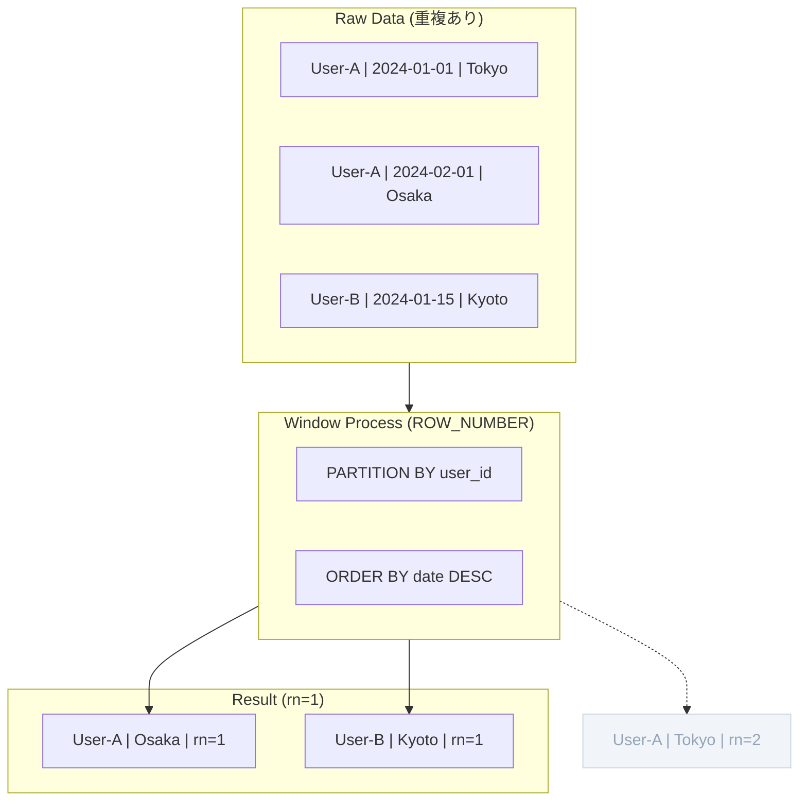

# 2.1: 重複排除と最新値の取得（ROW_NUMBER）

---

### 1. 【エンジニアの定義】Professional Definition

> **Window関数 (Window Functions)**:
> 通常の `GROUP BY` が行を「集約（圧縮）」するのに対し、Window関数は行の数を変えずに「特定の範囲（窓）」に対して計算を行う関数。 `OVER` 句を伴う。
>
> **ROW_NUMBER()**:
> 指定された順序に従って、各行に 1 から始まる連番を振る関数。重複データの特定や、「各グループの最大/最小/最新」を 1 件だけ抽出する際に使用される「重複排除の王道」。

---

### 2. 【0ベース・深掘り解説】Gap Filling

#### ❌ インタラクション爆発の恐怖
「ユーザーごとの最新の住所を取得したい」という要件に対し、初心者は以下のように書きます。
1. `MAX(update_date)` で最新日を特定する。
2. その日付と `user_id` で元のテーブルと再結合（JOIN）する。

**欠陥:** もし同じ日に 2 回更新があると、JOINの結果が 2 行になり、売上データが 2 倍になる事故（データの二重計上）が発生します。

#### ✅ ROW_NUMBER() による「絶対的な 1 件」の抽出
Window関数を使えば、全く同じ日付・時刻のデータが複数あっても、システム的に「どちらかを 1 番、どちらかを 2 番」と序列をつけ、確実に 1 行に絞り込むことができます。

---

### 3. 【視覚的ガイド】Visual Guide



---

### 4. 【技術実装】Implementation Best Practices

#### ✅ 標準的な最新値取得
```sql
WITH numbered_addresses AS (
  SELECT 
    user_id,
    address,
    updated_at,
    -- user_idごとにグループ化し、更新日の新しい順に背番号を振る
    ROW_NUMBER() OVER (
      PARTITION BY user_id 
      ORDER BY updated_at DESC, created_at DESC -- 同時刻対策
    ) AS rn
  FROM silver.user_address_history
)

-- 常に「最新の1件」だけを安全に抽出
SELECT * 
FROM numbered_addresses 
WHERE rn = 1;
```

#### 🚀 Databricks SQL プロの技 (QUALIFY)
Databricks SQLでは `QUALIFY` 句を使うことで、CTEなしで 1 行で書けます。
```sql
SELECT user_id, address, updated_at
FROM silver.user_address_history
-- WHERE句ではなくQUALIFY句でWindow関数の結果をフィルタリング
QUALIFY ROW_NUMBER() OVER (PARTITION BY user_id ORDER BY updated_at DESC) = 1;
```

---

### 5. 【Key Takeaways】

- **GROUP BYの代わり**: 特定の条件下での「最新」や「最大」を 1 件だけ残したい時は、迷わず `ROW_NUMBER()` を使う。
- **時刻の衝突に備える**: `ORDER BY` には `id` や `created_at` などのサブキーも指定し、順序を一意に固定する（Determinismの確保）。
- **QUALIFYの活用**: Databricks環境なら、クエリを短く保つために `QUALIFY` を積極的に利用する。
