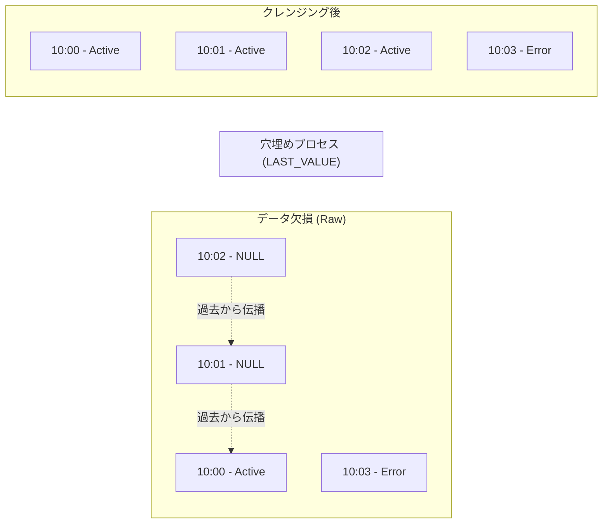

# 2.2: 欠損穴埋めと時系列比較（LEAD / LAG）

---

### 1. 【エンジニアの定義】Professional Definition

> **LAG()**:
> 現在の行から見て「前（過去）」の行のデータを取得する関数。1つ前の値と比較して増減率を出す際に多用される。
>
> **LEAD()**:
> 現在の行から見て「次（未来）」の行のデータを取得する関数。イベントとイベントの「間隔（滞在時間など）」を算出する際に便利。
>
> **LAST_VALUE() + IGNORE NULLS**:
> NULLが続くデータにおいて、最も近い過去の「非NULL値」で穴埋めをする、時系列クレンジングの強力な武器。

---

### 2. 【0ベース・深掘り解説】Gap Filling

#### 🔍 差分ログの落とし穴
例えばIoTセンサーや会員ランクのデータ。
「変更があった時だけ」ログが記録されるため、そのまま集計すると、データがない日の状態が「NULL」になってしまいます。

**例:** 
- 1月1日: プレミアム会員
- 1月10日までログなし
- 1月11日: ゴールド会員にランクダウン

1月5日のデータは「NULL」ですが、ビジネス的には「プレミアム継続中」であるべきです。これを「埋める」技術が求められます。

---

### 3. 【視覚的ガイド】Visual Guide



---

### 4. 【技術実装】Implementation Best Practices

#### ✅ NULLを直前の値で埋める (Forward Fill)
```sql
SELECT
  event_time,
  status,
  -- IGNORE NULLS を指定することで、NULLを飛ばして最新の値を拾い続ける
  LAST_VALUE(status) IGNORE NULLS OVER (
    ORDER BY event_time ASC
    ROWS BETWEEN UNBOUNDED PRECEDING AND CURRENT ROW -- 最初から現在まで
  ) AS current_status_filled
FROM silver.sensor_logs;
```

#### ✅ 滞在時間を算出する (LEAD)
```sql
SELECT
  user_id,
  page_url,
  visited_at,
  -- 次のページの訪問時刻を取得
  LEAD(visited_at) OVER (PARTITION BY user_id ORDER BY visited_at ASC) AS next_visit_at,
  -- 滞在秒数を計算
  unix_timestamp(LEAD(visited_at) OVER (PARTITION BY user_id ORDER BY visited_at ASC)) - 
  unix_timestamp(visited_at) AS stay_sec
FROM silver.page_views;
```

---

### 5. 【Key Takeaways】

- **IGNORE NULLS の魔法**: 複雑な `CASE WHEN` を書かなくても、Window関数のオプションだけで欠損補完が可能。
- **滞在時間は未来を見る**: `LEAD` を使って「次のアクション」の時刻を現在行に持ってくることで、1行完結の差分計算ができる。
- **枠（Frame）の定義**: `ROWS BETWEEN UNBOUNDED PRECEDING AND CURRENT ROW` を忘れると、予期しない範囲を計算対象にしてしまうので注意。
