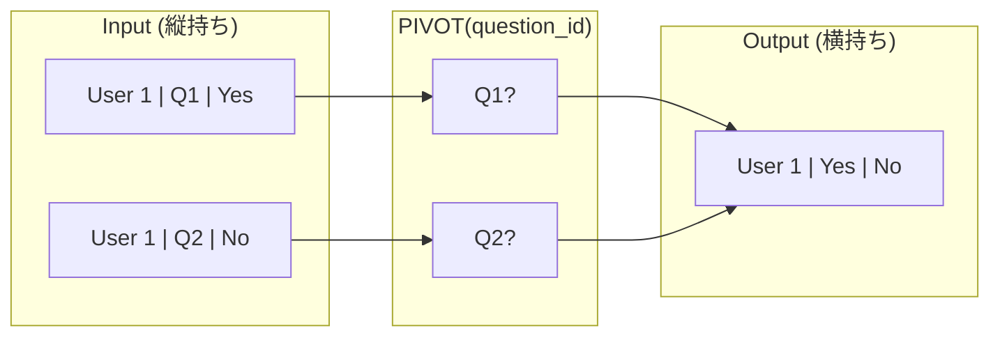

# 3.1: 縦持ちから横持ちへの変換（PIVOT）

---

### 1. 【エンジニアの定義】Professional Definition

> **PIVOT**:
> 特定の列の「値」を新しい「列名」として昇格させ、データを縦方向（正規化形式）から横方向（ワイド形式）に変換する操作。
>
> **集計（Aggregation）**:
> PIVOT操作は本質的に集計を伴う。複数行のデータを 1行にまとめるため、必ず `MAX`, `SUM`, `COUNT` などの集計関数を指定する必要がある。

---

### 2. 【0ベース・深掘り解説】Gap Filling

#### 🧐 なぜ PIVOT が必要なのか？
DBには「ユーザーID」「質問ID」「回答内容」という縦持ちでデータが入るのが一般的です（アンケートデータなど）。
しかし、このデータを機械学習にかけたり、Excelでクロス集計したりする場合、「1ユーザー 1行」で、各質問がカラムになっている必要があります。

**例:** 
- Input: `U1 | Q1 | Yes` / `U1 | Q2 | No`
- Output: `U1 | Answer_Q1:Yes | Answer_Q2:No`

PIVOTを使えば、複雑な `CASE WHEN` を何十個も書かなくても、宣言的に横持ち変換が可能です。

---

### 3. 【視覚的ガイド】Visual Guide



---

### 4. 【技術実装】Implementation Best Practices

#### ✅ PIVOT 構文による特徴量生成
```sql
SELECT *
FROM (
  -- 元となるデータを抽出
  SELECT 
    user_id, 
    question_id, 
    answer_text 
  FROM silver.survey_results
)
PIVOT (
  -- 1. カラムに入れたい「値」
  -- ※1ユーザー1回答のみならMAXで問題なし
  MAX(answer_text) 
  -- 2. カラム名にしたい「元の列の値」をリストアップ
  FOR question_id IN (
    'q01' AS q_purpose,
    'q02' AS q_interest,
    'q03' AS q_satisfaction
  )
);
```

#### ✅ なぜ集計関数(MAXなど)が必要か？
PIVOTは内部で `GROUP BY user_id` （PIVOT指定以外の列での集約）を行っています。SQLのルール上、集約された行の値を表示するには、たとえ 1件しかなくても集計関数が必要です。

---

### 5. 【Key Takeaways】

- **ワイドデータの作成**: 特徴量テーブルや、クロス集計レポートを作成する際の必須テクニック。
- **列名の固定**: `PIVOT` 句の `IN` リストで指定した値のみがカラムになる（それ以外は無視される）。
- **ダミー集計**: 文字列を横に並べるだけの時は `MAX()` を使うのが定石。
