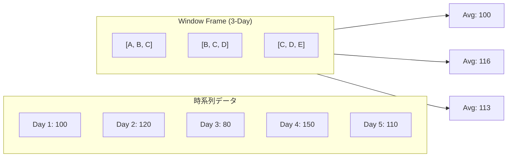

# 3.2: 時系列集計と移動平均（Window Frame）

---

### 1. 【エンジニアの定義】Professional Definition

> **移動平均 (Moving Average)**:
> データの乱高下を抑え、トレンドを把握するために、指定された期間（過去7日間など）の平均値を逐次算出すること。
>
> **Window Frame (ROWS / RANGE)**:
> Window関数において、「現在の行から前後何行（あるいは何日間）」を計算対象とするかを詳細に定義する構文。

---

### 2. 【0ベース・深掘り解説】Gap Filling

#### 🔍 「過去7日」の定義に注意
単純に `AVG(sales) OVER(ORDER BY date)` と書くと、データの最初から現在行までの「累計平均」になってしまいます。
「過去7日間」にするには、Windowの「枠（Frame）」を指定する必要があります。

さらに、**「過去7行」**と**「過去7日間（日付）」**は異なります。
売上が 0円の日（レコードがない日）がある場合、`ROWS` を使うと「データがある過去7日間」を拾ってしまうため、分析結果が歪みます。厳密な期間指定には `RANGE` を使います。

---

### 3. 【視覚的ガイド】Visual Guide



---

### 4. 【技術実装】Implementation Best Practices

#### ✅ 過去7日間の移動平均（ROWS指定）
```sql
SELECT
  order_date,
  daily_revenue,
  -- 過去6行 ＋ 現在行 ＝ 合計7行の平均
  AVG(daily_revenue) OVER (
    ORDER BY order_date ASC
    ROWS BETWEEN 6 PRECEDING AND CURRENT ROW
  ) AS moving_avg_7d
FROM silver.daily_sales;
```

#### ✅ 厳密な過去7日間の移動平均（RANGE指定 / Databricks SQL）
```sql
SELECT
  order_date,
  daily_revenue,
  -- 日付が欠損していても、カレンダー上の「過去7日間」を正しく計算
  AVG(daily_revenue) OVER (
    ORDER BY CAST(order_date AS TIMESTAMP) 
    RANGE BETWEEN INTERVAL 6 DAYS PRECEDING AND CURRENT ROW
  ) AS strict_moving_avg_7d
FROM silver.daily_sales;
```

---

### 5. 【Key Takeaways】

- **トレンド把握**: 単日の数値に一喜一憂せず、移動平均でトレンドを掴むのがKPI分析の基本。
- **欠損の考慮**: 土日祝日などデータがない可能性がある場合は、 `ROWS` ではなく `RANGE` を検討する。
- **パフォーマンス**: Window関数は自己結合（SELF JOIN）よりも圧倒的に高速かつメモリ効率が良い。
