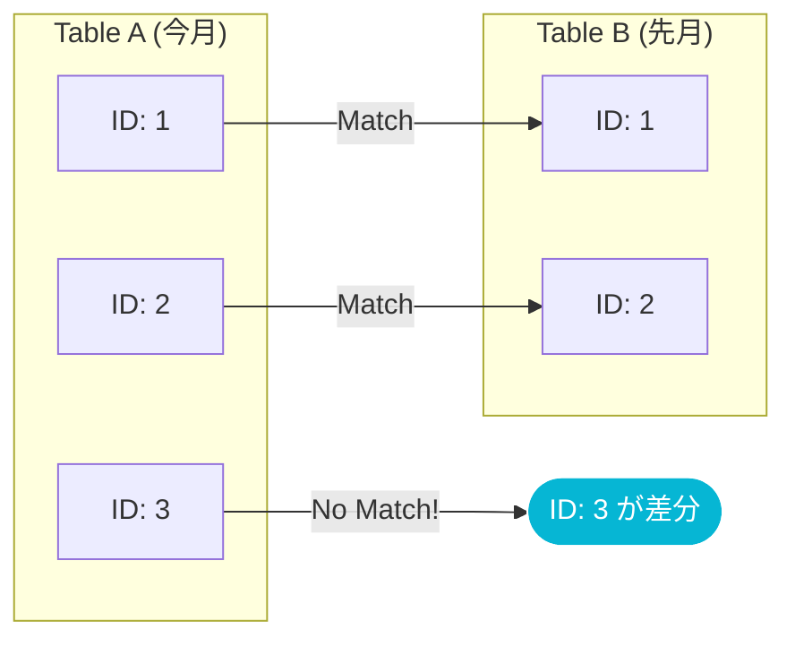

# 3.3: 差分抽出とリスト比較（EXCEPT / ANTI JOIN）

---

### 1. 【エンジニアの定義】Professional Definition

> **集合演算 (Set Operations)**:
> クエリの結果（集合）同士を、数学的に合成・比較する操作。 `UNION` (和), `INTERSECT` (積), `EXCEPT` (差) がある。
>
> **LEFT ANTI JOIN**:
> 「左側のテーブルには存在するが、右側のテーブルには存在しない」行のみを抽出するJOIN方式。差分抽出や「退会者リスト」「未購入者リスト」の作成において、最もパフォーマンスが高い手法の一つ。

---

### 2. 【0ベース・深掘り解説】Gap Filling

#### 🔍 「今月だけの人」をどう探すか？
「先月の顧客リスト」と「今月の顧客リスト」があります。
- 先月: [A, B, C]
- 今月: [B, C, D]

「新規顧客」は D です。これを探すには、「今月 **EXCEPT** 先月」と書くか、「今月 を左、先月 を右にして **ANTI JOIN**」します。

`EXCEPT` は全ての列が完全一致しているかを見ますが、 `ANTI JOIN` は `user_id` などの特定のキーだけを基準に比較できます。実務では 9割のケースで **ANTI JOIN** が好まれます。

---

### 3. 【視覚的ガイド】Visual Guide



---

### 4. 【技術実装】Implementation Best Practices

#### ✅ LEFT ANTI JOIN による差分抽出 (推奨)
```sql
-- 昨日のスナップショットにはいたが、今日はいなくなった「退会者」を探す
SELECT 
  y.user_id,
  y.email
FROM 
  silver.users_snapshot_yesterday y
-- 右側に存在しないIDだけを残す
LEFT ANTI JOIN 
  silver.users_snapshot_today t
  ON y.user_id = t.user_id;
```

#### ✅ EXCEPT による完全一致比較
```sql
-- テーブル全体の定義（全カラム）に差分があるレコードを抽出する
-- 監査やデータ移行後の検証に便利
SELECT * FROM table_legacy
EXCEPT
SELECT * FROM table_modern;
```

---

### 5. 【Key Takeaways】

- **引き算の思考**: 「〜していない人」「昨日より減ったデータ」を出す時は、まず ANTI JOIN を疑う。
- **パフォーマンス**: 大規模データにおいて、 `NOT IN (SELECT ...)` や `NOT EXISTS` よりも `LEFT ANTI JOIN` の方がオプティマイザにとって理解しやすく、高速に動作する傾向がある。
- **重複排除**: `EXCEPT` は結果から暗黙的に重複を削除（DISTINCT）するが、 `LEFT ANTI JOIN` は左側の行をそのまま維持する。意図に応じて使い分ける。
