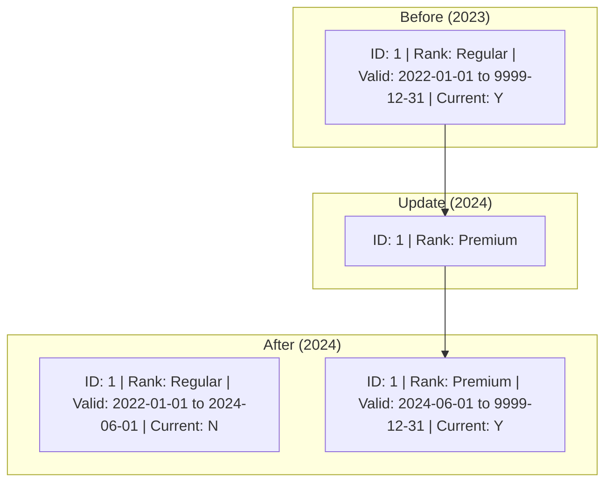

# 4.2: 履歴管理と変更履歴保持（SCD Type 2）

---

### 1. 【エンジニアの定義】Professional Definition

> **SCD (Slowly Changing Dimension)**:
> 時間とともにゆっくりと変化する属性（住所、役職、会員ランク等）を扱うための設計手法。
> 
> **SCD Type 2**:
> 履歴をすべて保持する手法。既存の行を上書きせず、新しい行を追加し、各行に「有効期間（開始日、終了日）」と「最新フラグ」を持たせる。過去のある時点での属性を正確に再現するために必須。

---

### 2. 【0ベース・深掘り解説】Gap Filling

#### 🧐 なぜ履歴が必要なのか？
例えば、あるユーザーが 3月に「通常会員」で 100円の買い物をし、6月に「プレミアム会員」になったとします。
もし Type 1（上書き）で管理していると、過去の 3月の売上を見ようとした時、当時のランクが「プレミアム」だったと誤認してしまいます。

これを防ぐために、「3月時点では通常だった」という**過去の事実を残しておく**のが SCD Type 2 です。

---

### 3. 【視覚的ガイド】Visual Guide



---

### 4. 【技術実装】Implementation Best Practices

#### ✅ Delta Live Tables (DLT) による自動実装
SCD Type 2 を手書きの SQL で実装しようとすると、古い行のクローズと新しい行の追加を同時に管理する必要があり、非常に複雑でバグが起きやすいです。Databricksでは、DLTの機能を使って宣言的に記述できます。

```python
import dlt

# SCD Type 2 の履歴保持テーブルを定義
dlt.create_streaming_live_table("dim_customers_scd2")

dlt.apply_changes(
  target = "dim_customers_scd2",
  source = "customer_cdc_stream",
  keys = ["user_id"],
  sequence_by = dlt.expr("update_timestamp"),
  # ここで 2 を指定するだけで、開始日・終了日・フラグが自動管理される
  stored_as_scd_type = "2"
)
```

#### ✅ 過去時点の結合（Point-in-Time Join）
分析時に当時の属性で結合する方法：
```sql
SELECT 
  s.order_id,
  s.amount,
  c.rank AS rank_at_purchase -- 購入当時のランク
FROM sales s
JOIN dim_customers_scd2 c
  ON s.user_id = c.user_id
  -- 購入日が有効期間内にある行を結合する
  AND s.order_date >= c.valid_from
  AND s.order_date < c.valid_to;
```

---

### 5. 【Key Takeaways】

- **分析の正確性**: 過去の売上分析など、時点情報を重視するなら SCD Type 2 は標準装備。
- **管理の簡素化**: `MERGE` で自作するよりも、DLT の `apply_changes` やフレームワークを活用する方が安全で保守性が高い。
- **データ量の増大**: 変更のたびに行が増えるため、不要なカラム（頻繁に変わるが分析に使わないもの）は、このテーブルに含めない設計にする。
