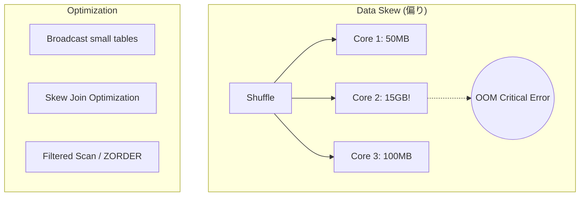

# 4.3: パフォーマンス・トラブルシューティング

---

### 1. 【エンジニアの定義】Professional Definition

> **Data Skew (データの偏り)**:
> 分散処理において、特定のキー（例: user_id=NULL など）にデータが集中し、一部のワーカーノードだけが過負荷になり、処理全体が停滞（Straggler）する現象。
>
> **Broadcast Join**:
> 小さなテーブル（マスタ等）を全ワーカーノードに複製して配布し、ネットワーク経由の重いデータ移動（Shuffle）を回避する高速な結合手法。

---

### 2. 【0ベース・深掘り解説】Gap Filling

#### 🔍 クエリが終わらない 3大原因
1. **Cross Join (直積)**: JOIN条件が不適切なせいで、数千万行 × 数千万行 の全組み合わせを計算しようとしている。
2. **Data Skew**: クラスターの 99のノードは暇なのに、1つのノードだけが 10GBのデータを処理してパンクしている。
3. **Spill to Disk**: メモリに入り切らない中間データが遅いディスクに書き出されている。

これらを解決するには、「大きなサーバーにする」前に、**「処理するデータ量を減らす・逃がす」**設計が先決です。

---

### 3. 【視覚的ガイド】Visual Guide



---

### 4. 【技術実装】Implementation Best Practices

#### ✅ Skew Join の自動補正 (AQE)
Databricks では、Adaptive Query Execution (AQE) を有効にすることで、データの偏りを自動検知して分割処理してくれます。

```sql
-- AQE を有効化（通常はデフォルトでON）
SET spark.sql.adaptive.enabled = true;
-- スキュー結合の最適化を明示的に有効化
SET spark.sql.adaptive.skewJoin.enabled = true;
```

#### ✅ Broadcast Join のヒント
数千万行のファクトテーブルと、数万行のマスタを結合する場合。
```sql
SELECT /*+ BROADCAST(m) */ 
  f.order_id, 
  m.category_name
FROM gold.fact_sales f
JOIN silver.category_master m ON f.category_id = m.category_id;
```

#### ✅ ファイルを物理的に並べ替える (ZORDER)
JOINやWHERE句によく使う列を指定することで、データの読み込みスキップ効率を劇的に上げます。
```sql
OPTIMIZE gold.fact_sales 
ZORDER BY (user_id, event_date);
```

---

### 5. 【Key Takeaways】

- **実行計画を読む**: Spark UI や `EXPLAIN` で「SortMergeJoin」が走っているか「BroadcastHashJoin」かを確認する。
- **早期フィルタリング**: JOINの前に `WHERE` で可能な限り行数を絞り込む（Predicate Pushdownの活用）。
- **物理設計の勝利**: インデックスの代わりに `ZORDER` や `PARTITION` を適切に配置することで、クエリは 10倍以上速くなる。
